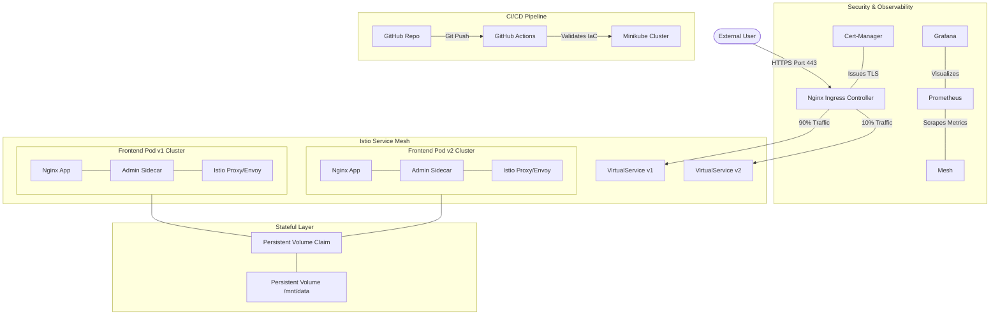

# 🏗️ Technical Architecture: Enterprise Kubernetes Platform

## 🗺️ System Flow Diagram

## 🛠️ Integrated Feature Set
1.  **Phase 1 (Foundations):** RBAC Control, Namespace Isolation (`lfs158`).
2.  **Phase 2 (Persistence):** PV/PVC Storage, Kubernetes Secrets, ConfigMaps.
3.  **Phase 3 (Elasticity):** HPA (CPU-based scaling), Nginx Ingress Routing.
4.  **Phase 4 (Hardening):** Cert-Manager (TLS), Prometheus & Grafana Monitoring.
5.  **Phase 5 (Traffic Engineering):** Istio Service Mesh, 90/10 Canary Shifting, GitHub Actions.
