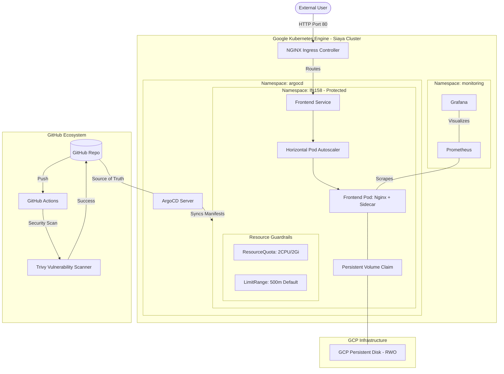

# 🏗️ Technical Architecture: Verified Enterprise GKE Platform

## 🗺️ System Flow Diagram (Phases 1-6)

## 🛠️ Integrated Feature Set
1.  **Phase 1 (Foundations):** Namespace Isolation (`lfs158`), RBAC `pod-reader` role.
2.  **Phase 2 (Persistence):** GKE Persistent Disks (RWO) via PVCs for data durability.
3.  **Phase 3 (Elasticity):** HPA-driven scaling (CPU 50%) aligned with storage limits.
4.  **Phase 4 (Hardening):** Automated security with **Trivy** vulnerability scanning.
5.  **Phase 5 (Traffic Engineering):** **NGINX Ingress Controller** (IP: 35.194.3.0) for edge routing.
6.  **Phase 6 (Cloud-Native & Observability):** **ArgoCD** GitOps, **ResourceQuotas**, and **Prometheus/Grafana** metrics.

---
*Authorized by: Head of PMO*
