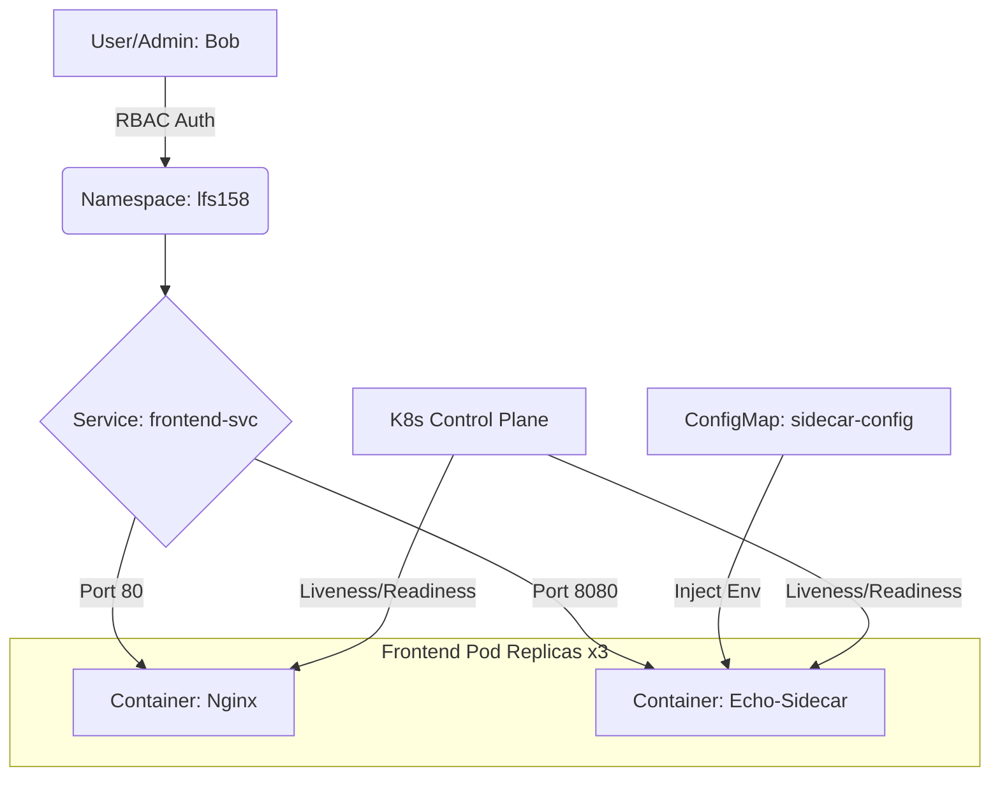

# Kubernetes Platform Engineering Project: Secure Multi-Container Architecture

## 🚀 Architectural Workflow


## 🛠️ Key Architectural Features
* **RBAC Governance:** Implemented a dedicated namespace (`lfs158`) with restricted user access.
* **Multi-Container Pods:** Utilized the **Sidecar Pattern** for administrative observability.
* **Configuration Decoupling:** Used **ConfigMaps** to ensure the infrastructure is environment-agnostic.
* **Resource Reliability:** Defined **CPU/Memory Requests & Limits** for Burstable QoS.

## 📋 Infrastructure Audit
```json
{
  "host": {
    "hostname": "localhost",
    "ip": "127.0.0.1"
  },
  "environment": {
    "HOSTNAME": "frontend-deploy-6ccd986ff9-jn24b",
    "FRONTEND_SVC_SERVICE_HOST": "10.99.43.97",
    "KUBERNETES_SERVICE_HOST": "10.96.0.1"
  }
}
```

## 🏛️ Governance
This project is governed by a formal [Project Charter](./PROJECT_CHARTER.md) outlining the PMP-aligned objectives and success criteria.
