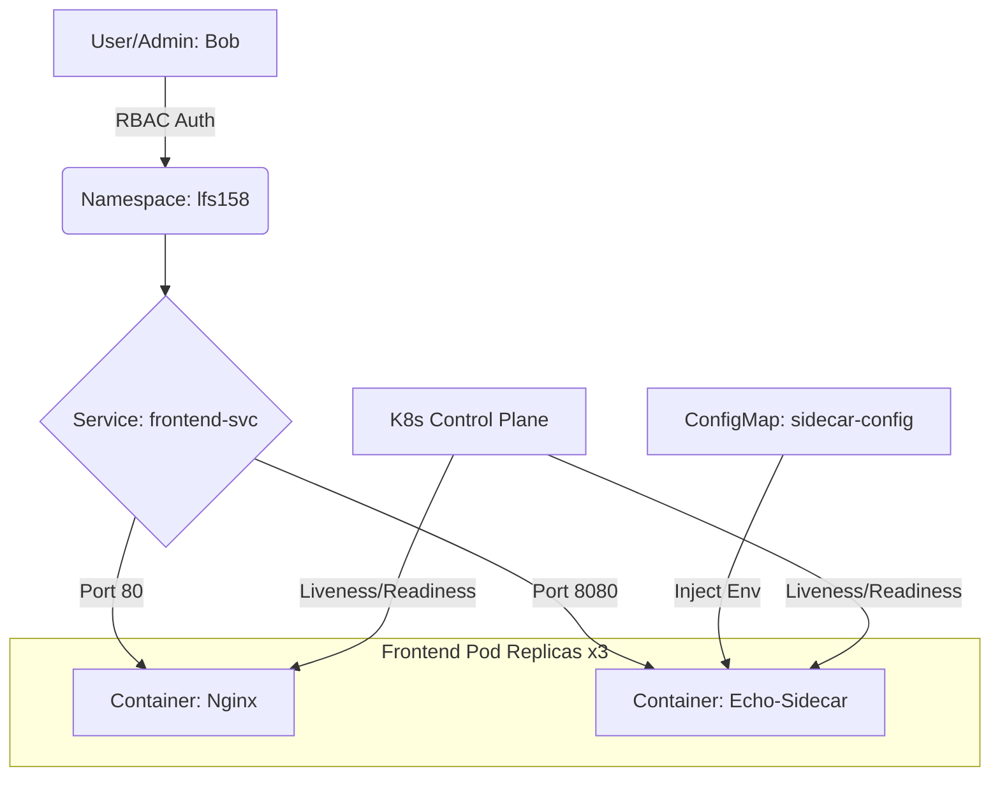

# Kubernetes Platform Engineering Project: Secure Multi-Container Architecture

## 🚀 Architectural Workflow


## 🛠️ Key Architectural Features
* **RBAC Governance:** Implemented a dedicated namespace (`lfs158`) with restricted user access (User: Bob).
* **Multi-Container Pods:** Utilized the **Sidecar Pattern** by deploying an Nginx frontend with an Echo-Server admin sidecar.
* **Service Discovery:** Configured a **Multi-Port LoadBalancer Service** (80/8080).
* **Configuration Decoupling:** Used **ConfigMaps** to manage environment variables (SIDECAR_PORT).
* **Resource Reliability:** Defined **CPU/Memory Requests & Limits** to achieve **Burstable QoS**.

## 📋 Infrastructure Audit (Live Snapshot)
```json
{
  "host": {
    "hostname": "localhost",
    "ip": "127.0.0.1"
  },
  "environment": {
    "HOSTNAME": "frontend-deploy-6ccd986ff9-jn24b",
    "FRONTEND_SVC_SERVICE_HOST": "10.99.43.97",
    "KUBERNETES_SERVICE_HOST": "10.96.0.1"
  }
}
```

## 🌐 Networking & Service Types
* **LoadBalancer:** Integrated with `minikube tunnel` for external IP simulation.
* **Port-Forwarding:** Utilized `kubectl port-forward svc/frontend-svc 8081:8080` for direct sidecar debugging.

## 🏛️ Governance
This project follows a rigorous PMBOK-aligned governance structure. Detailed objectives and success criteria are documented in the [Enterprise Project Charter](./PROJECT_CHARTER.md).

---
**Project Lead:** Dan Alwende, PMP, CSPO  
*Project Manager | Solutions Architect | Platform Engineer*

## 🛡️ Security Audit & Incident Response
* **Incident INC-001:** Identified accidental exposure of non-production metadata.
* **Response:** Performed a repository-wide history scrub and implemented a robust `.gitignore` strategy.
* **Compliance:** The project now utilizes localized `.gitignore` patterns to ensure zero-leakage of sensitive YAML or JSON artifacts.
