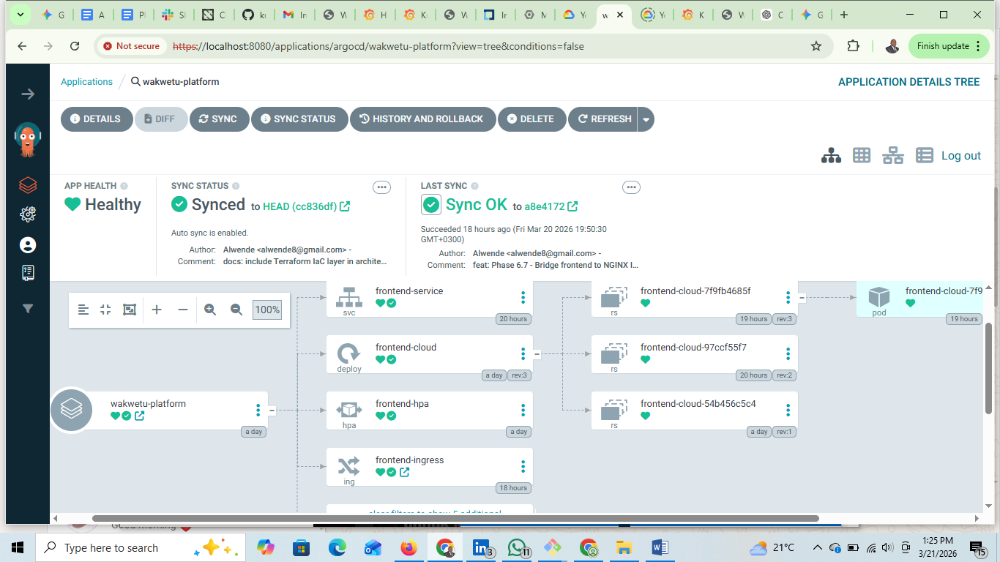
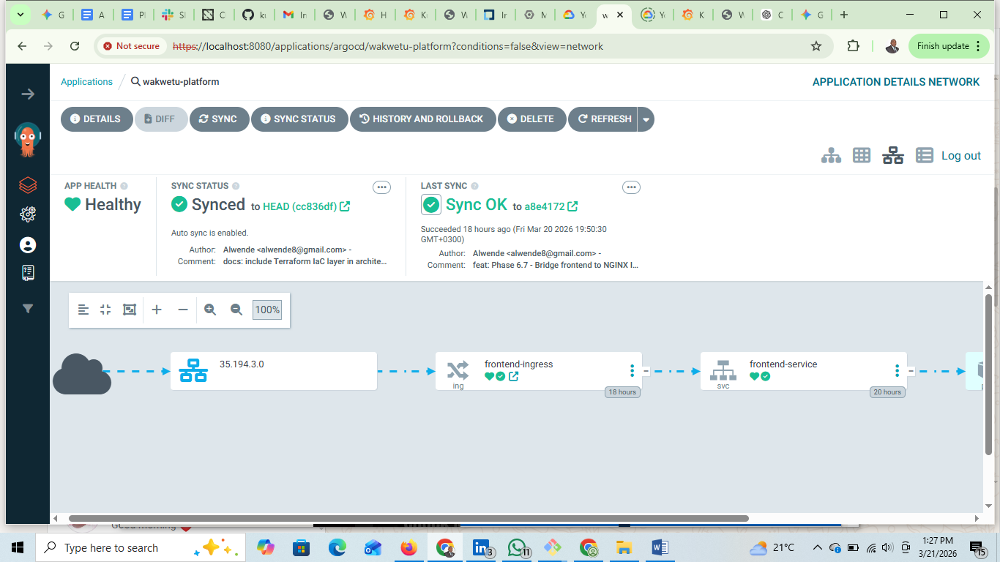
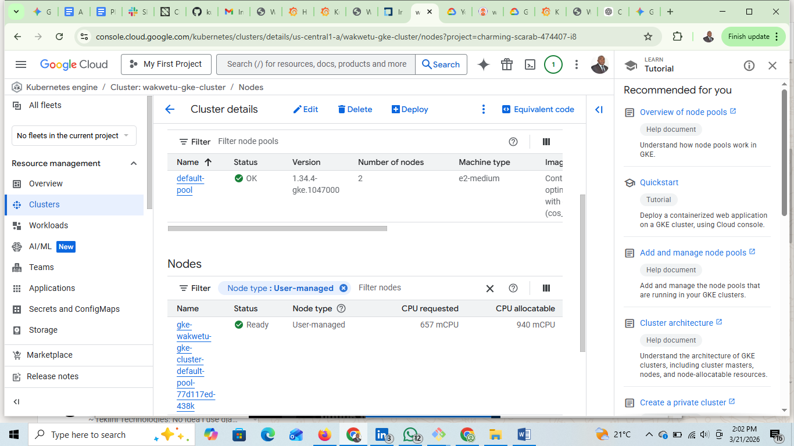
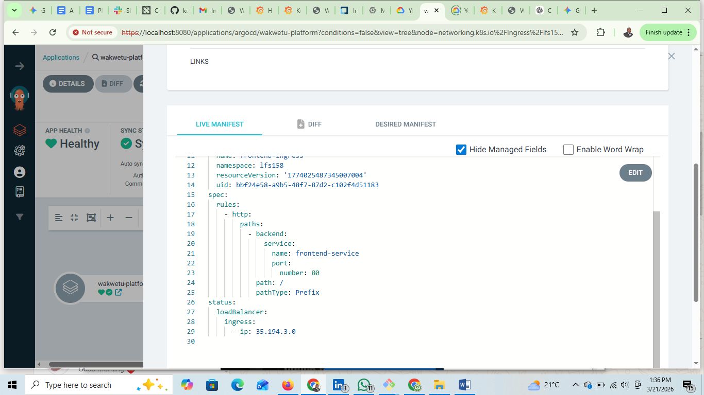
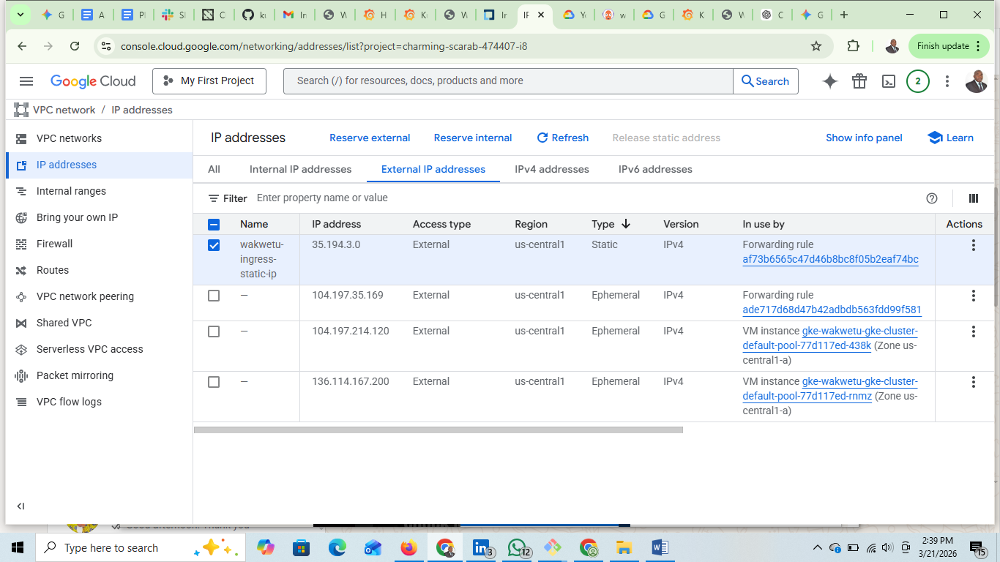
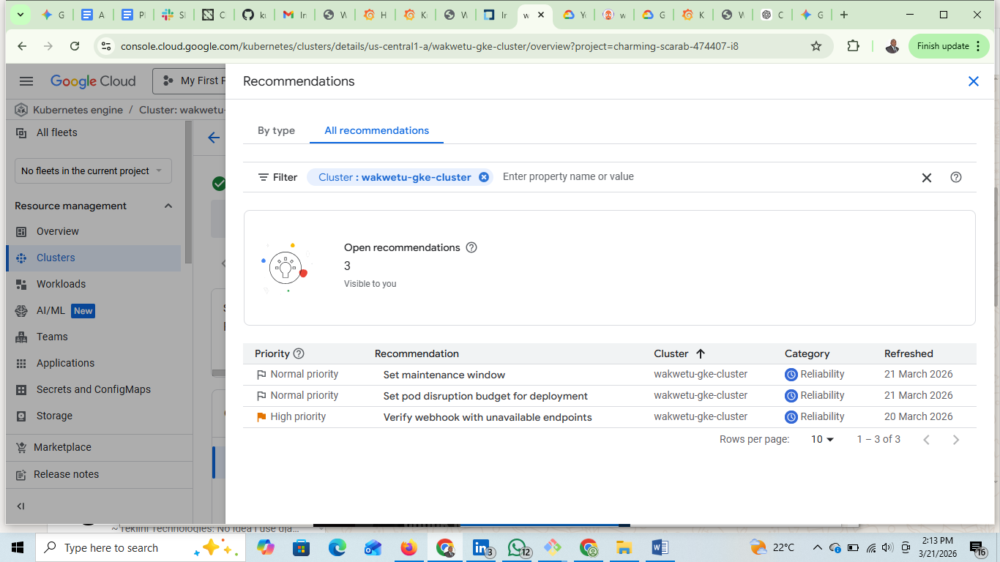
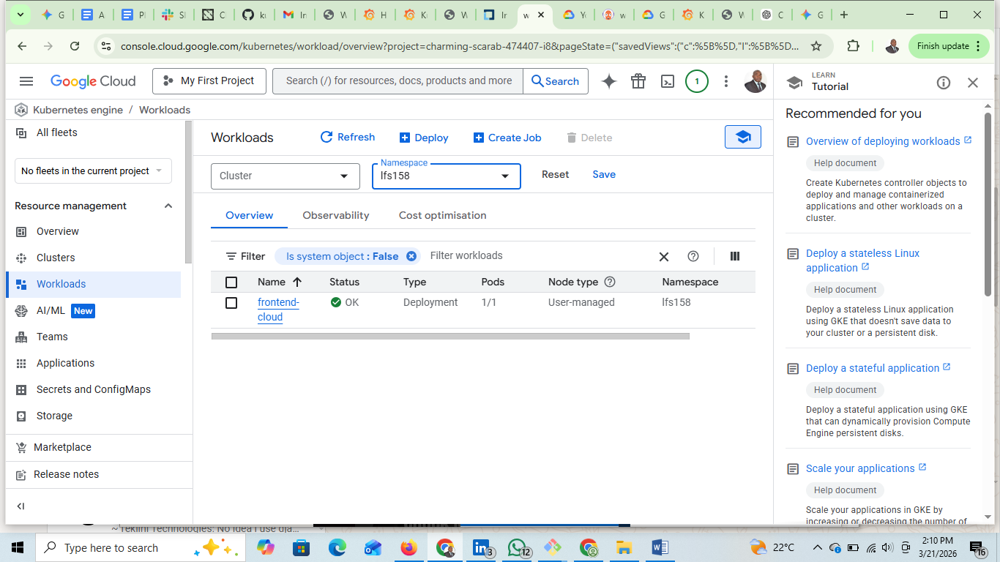
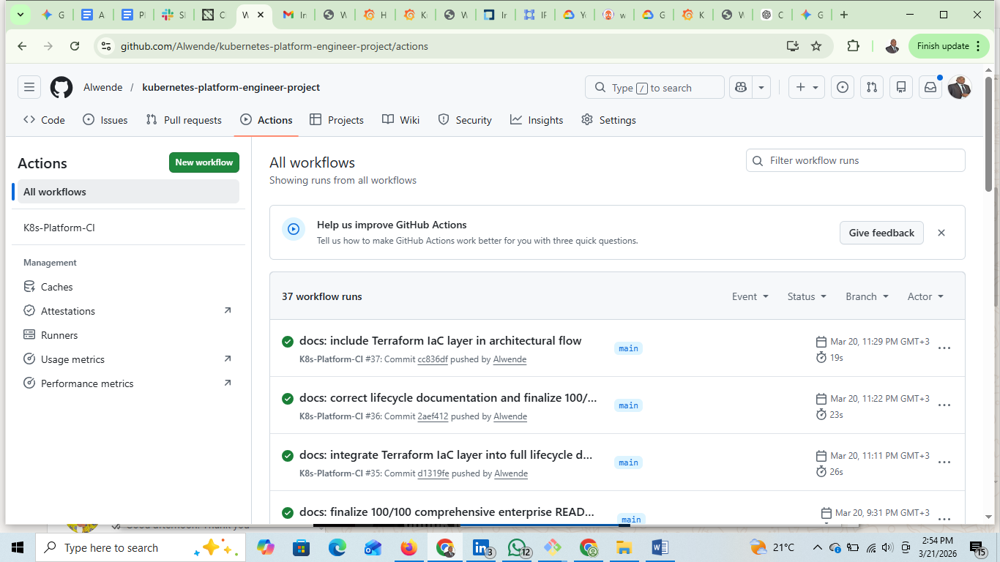

# 📊 Production Verification & Evidence Ledger: GKE Enterprise Platform

This document serves as the formal verification of the **Phase 6: GKE Cloud-Native Pivot**. It provides a visual audit trail of the infrastructure, security, and GitOps governance implemented for the Wakwetu Modernization.

---

### 1. GitOps Sovereignty (ArgoCD)
**What was achieved:** 100% synchronization between the GitHub "Source of Truth" and the GKE Cluster.
- **Evidence 01 & 02:** Shows the full resource tree, confirming that the Deployment, Service, and ReplicaSets are "Healthy" and "Synced" without manual drift.

---

### 2. Infrastructure as Code: GKE Node Pool
**What was achieved:** Orchestration of a 3-node regional GKE cluster using **Terraform**.
- **Evidence 03:** Verifies the **e2-medium** node pool status as "OK." This confirms the underlying compute layer was provisioned correctly via IaC.

---

### 3. Traffic Engineering: Static Edge Ingress
**What was achieved:** Elimination of "IP Drift" by promoting the ephemeral load balancer IP to a **Static Reservation**.
- **Evidence 04 & 05:** Confirms the NGINX Ingress is mapped to a static Public IP (**35.194.3.0**), ensuring business continuity and reliable DNS mapping.

---

### 4. Operational Intelligence & Health
**What was achieved:** Day-2 monitoring and proactive reliability management.
- **Evidence 06 & 07:** Displays the GKE Reliability Recommendations and the verified 'OK' status of the **lfs158** workloads. This proves the system is not just running, but is being actively governed.

---

### 5. Continuous Delivery (GitHub Actions)
**What was achieved:** Automated security scanning and deployment trigger.
- **Evidence 08:** Verifies the **CI/CD pipeline** success, ensuring every commit undergoes a security scan before reaching the GitOps loop.

---
**Verification Date:** March 21, 2026
**Authorized by:** Head of PMO / Solutions Architect
